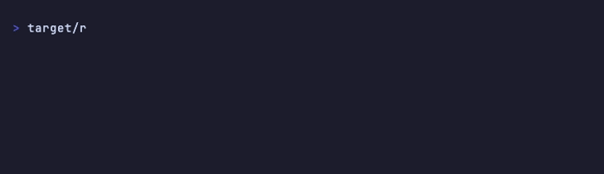

# mbtop

[](https://github.com/matheuseabra/mbtop/actions/workflows/ci.yml)
[](https://github.com/matheuseabra/mbtop/releases)
[](LICENSE)



`mbtop` is a tiny, fast system monitor made for small terminal panes. It shows the signals that are useful at a glance without trying to become another process manager:

- CPU usage with a short history sparkline
- memory and root-disk usage
- 1, 5, and 15 minute load averages
- aggregate network receive/transmit rate
- uptime and CPU count


The UI inherits the terminal's default foreground and background. It uses only semantic ANSI palette colors for muted and warning states, so it stays at home in a custom terminal theme. The compact card needs at least `36×8`; if a pane shrinks below that, mbtop centers a resize hint until there is room again.

The renderer uses [Ratatui](https://ratatui.rs/) primitives for the CPU sparkline, memory/disk gauges, rounded borders, and resize-aware layout. See [the design research notes](docs/terminal-ui-research.md) for the comparison with btop's graph and theme choices.

Use `--icon` for compact glyph labels when the pane is especially narrow:

```sh
mbtop --icon
```

Use `--borderless` when the surrounding terminal layout already provides a frame:

```sh
mbtop --borderless
```

Charts use a terminal-palette gradient from cyan through green and yellow to red as values rise.

## Install

With Rust installed:

```sh
cargo install --path .
```

With Homebrew on macOS:

```sh
brew install matheuseabra/tap/mbtop
```

Or run it from a checkout:

```sh
cargo run --release
```

## Usage

```text
mbtop 0.1.7 — tiny system monitor for terminal dashboard panes

Usage: mbtop [OPTIONS]

Options:
  -d, --disk <PATH>       Disk mount or path to report (default: /)
  -i, --interval <MS>     Refresh interval in milliseconds (default: 1000)
      --icon              Use compact Unicode glyphs instead of text labels
      --borderless        Omit the dashboard's outer border
  -h, --help              Show this help
  -V, --version           Show version

Keys: q / Esc / Ctrl-C to quit
```

It is intentionally friendly to tmux and other dashboard layouts:

```sh
mbtop --interval 2000
```

## Demo

The checked-in demo is generated with [VHS](https://github.com/charmbracelet/vhs):

```sh
cargo build --release --locked
vhs docs/mbtop.tape
```

## Development

```sh
cargo fmt --check
cargo test
cargo clippy --all-targets --all-features -- -D warnings
```

## License

MIT. See [LICENSE](LICENSE).

Please read [CONTRIBUTING.md](CONTRIBUTING.md) before opening a pull request, and use the private process in [SECURITY.md](SECURITY.md) for vulnerability reports.
